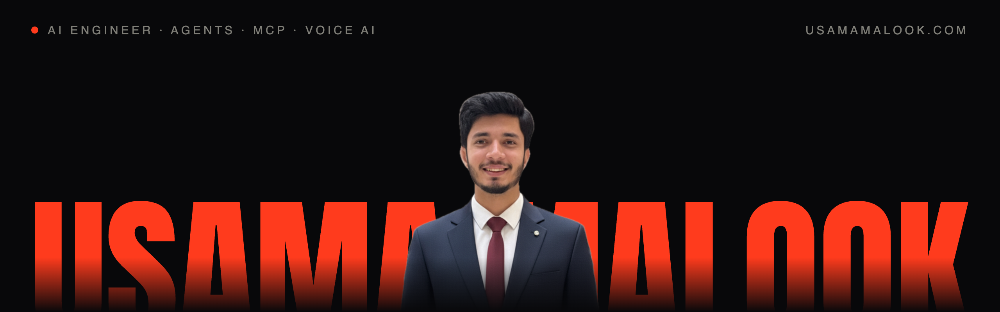

### AI engineer building agent platforms, MCP systems and voice AI that run in production.

Full Stack AI Engineer at **Hyly.AI**, building autonomous agent automation on MCP with coding agents as my daily workflow. Before that I led a team of five at **Dubizzle Labs** across CRM, real-time messaging and voice AI. Five years shipping software from Lahore, Pakistan.

   

---

### Selected work

Most of my work lives in private company repositories, so each system below links to a written case study instead.

| System | What it does | In production |
|---|---|---|
| **[Autonomous Wiki Sync](https://usamamalook.com/work/wiki)** · Hyly.AI | Self-updating docs that re-sync Notion and source repos on every change, serving each team its own format | Shipped in 72 hours with Claude Code |
| **[AI Command Center](https://usamamalook.com/work/mcp)** · Dubizzle Labs | MCP platform putting 3 CRM products behind one AI client, with permissions routed through each product's own auth | 3 CRMs → 1 client, shipped in a week |
| **[Echo](https://usamamalook.com/work/echo)** · Dubizzle Labs | AI telesales voice agent: streaming speech-to-text, a LangChain dialogue engine and post-call prompt analysis | 1,000+ calls a day · 95% intent accuracy |
| **[Loom](https://usamamalook.com/work/loom)** · Dubizzle Labs | Multi-tenant WhatsApp and email platform with Socket.IO, Redis clustering and at-least-once RabbitMQ delivery | 5,000+ conversations a day · 10+ brands |
| **[SmartDoc](https://usamamalook.com/work/smartdoc)** · Logiks Dev | OCR pipeline with OpenCV preprocessing and a TensorFlow CNN classifying 10+ document types | 500+ documents a day · 98% extraction |

### Writing

- **[Route permissions, never copy them](https://usamamalook.com/blog/route-permissions-never-copy-them)**: the one decision behind putting an AI client in front of three CRMs.
- **[The agent count is not the architecture](https://usamamalook.com/blog/the-agent-count-is-not-the-architecture)**: why a four-agent pipeline works because of its handoffs, not its size.

### Stack

**AI and agents** · LLM agents, Model Context Protocol, multi-agent systems, RAG, LangChain, OpenAI API, Whisper, ElevenLabs, Claude Code 
**Backend** · Python, TypeScript, Node.js, NestJS, FastAPI, WebSockets, RabbitMQ, Redis 
**Data and cloud** · PostgreSQL, MySQL, Elasticsearch, AWS, GCP, Docker, GitHub Actions 
**Frontend** · React, Next.js

---

Building something that has to work in production? Write to me at <a href="mailto:usamasam687@gmail.com">usamasam687@gmail.com</a>.
